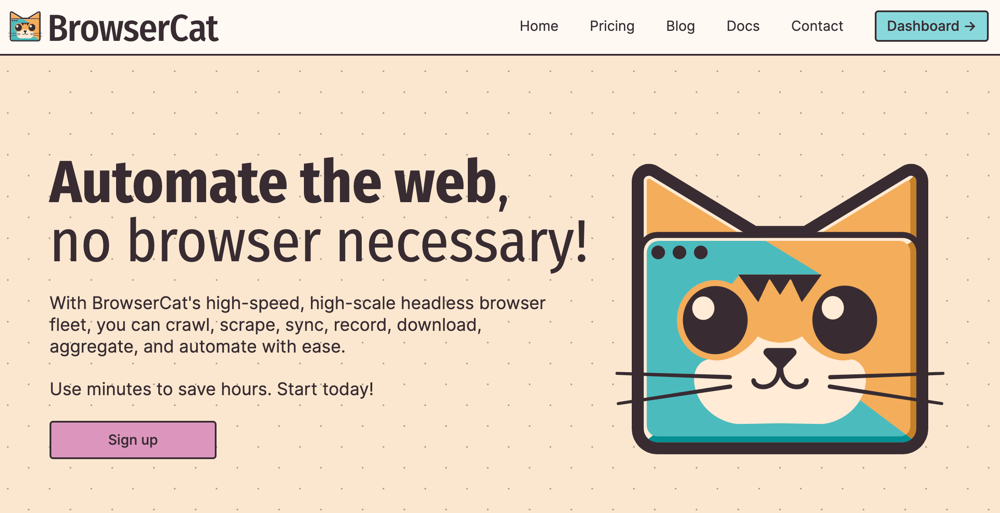

<div align="center">

[](https://browsercat.com)

# [Browsercat](https://browsercat.com)<a id="browsercat"></a>

Providing purr-fect headless browser access via utility endpoints and direct websocket connections.

</div>

## Table of Contents<a id="table-of-contents"></a>

<!-- toc -->

- [Installation](#installation)
- [Getting Started](#getting-started)
- [Reference](#reference)
  * [`browsercat.apiKeys.createApiKey`](#browsercatapikeyscreateapikey)
  * [`browsercat.apiKeys.getKey`](#browsercatapikeysgetkey)
  * [`browsercat.apiKeys.listAll`](#browsercatapikeyslistall)
  * [`browsercat.apiKeys.revokeKey`](#browsercatapikeysrevokekey)
  * [`browsercat.apiKeys.updateApiKey`](#browsercatapikeysupdateapikey)
  * [`browsercat.apiKeys.updateKey`](#browsercatapikeysupdatekey)
  * [`browsercat.billing.getActiveSubscription`](#browsercatbillinggetactivesubscription)
  * [`browsercat.billing.getInvoicePdf`](#browsercatbillinggetinvoicepdf)
  * [`browsercat.billing.getSpecificInvoice`](#browsercatbillinggetspecificinvoice)
  * [`browsercat.billing.getSpecificSubscription`](#browsercatbillinggetspecificsubscription)
  * [`browsercat.billing.listInvoicesRange`](#browsercatbillinglistinvoicesrange)
  * [`browsercat.billing.listSubscriptionsWithinRange`](#browsercatbillinglistsubscriptionswithinrange)
  * [`browsercat.browsers.establishConnection`](#browsercatbrowsersestablishconnection)
  * [`browsercat.openAPI.exploreFunctionality`](#browsercatopenapiexplorefunctionality)
  * [`browsercat.openAPI.getSpecJson`](#browsercatopenapigetspecjson)
  * [`browsercat.openAPI.getYamlSpec`](#browsercatopenapigetyamlspec)
  * [`browsercat.server.checkHealthStatus`](#browsercatservercheckhealthstatus)
  * [`browsercat.server.showMetrics`](#browsercatservershowmetrics)
  * [`browsercat.usage.getEventData`](#browsercatusagegeteventdata)
  * [`browsercat.usage.getRequestData`](#browsercatusagegetrequestdata)
  * [`browsercat.usage.getSessionRange`](#browsercatusagegetsessionrange)
  * [`browsercat.usage.listAggregateAccountUsage`](#browsercatusagelistaggregateaccountusage)
  * [`browsercat.usage.listRequestEvents`](#browsercatusagelistrequestevents)

<!-- tocstop -->

## Installation<a id="installation"></a>
<div align="center">
  <a href="https://konfigthis.com/sdk-sign-up?company=BrowserCat&language=TypeScript">
    
  </a>
</div>

## Getting Started<a id="getting-started"></a>

```typescript
import { BrowserCat } from "browser-cat-typescript-sdk";

const browsercat = new BrowserCat({
  // Defining the base path is optional and defaults to https://api.browsercat.com
  // basePath: "https://api.browsercat.com",
  jwtCookie: "API_KEY",
  accessToken: "ACCESS_TOKEN",
  keyHeader: "API_KEY",
});

const createApiKeyResponse = await browsercat.apiKeys.createApiKey({
  name: "name_example",
  role: "member",
});

console.log(createApiKeyResponse);
```

## Reference<a id="reference"></a>


### `browsercat.apiKeys.createApiKey`<a id="browsercatapikeyscreateapikey"></a>

Create a new API key.

#### 🛠️ Usage<a id="🛠️-usage"></a>

```typescript
const createApiKeyResponse = await browsercat.apiKeys.createApiKey({
  name: "name_example",
  role: "member",
});
```

#### ⚙️ Parameters<a id="⚙️-parameters"></a>

##### name: `string`<a id="name-string"></a>

##### role: `string`<a id="role-string"></a>

##### expiredAt: `string`<a id="expiredat-string"></a>

#### 🔄 Return<a id="🔄-return"></a>

[KeySecret](./models/key-secret.ts)

#### 🌐 Endpoint<a id="🌐-endpoint"></a>

`/auth/keys` `POST`

[🔙 **Back to Table of Contents**](#table-of-contents)

---


### `browsercat.apiKeys.getKey`<a id="browsercatapikeysgetkey"></a>

Retrieve an API key.

#### 🛠️ Usage<a id="🛠️-usage"></a>

```typescript
const getKeyResponse = await browsercat.apiKeys.getKey({
  keyId: "keyId_example",
});
```

#### ⚙️ Parameters<a id="⚙️-parameters"></a>

##### keyId: `string`<a id="keyid-string"></a>

#### 🔄 Return<a id="🔄-return"></a>

[KeyPublic](./models/key-public.ts)

#### 🌐 Endpoint<a id="🌐-endpoint"></a>

`/auth/keys/{keyId}` `GET`

[🔙 **Back to Table of Contents**](#table-of-contents)

---


### `browsercat.apiKeys.listAll`<a id="browsercatapikeyslistall"></a>

List all API keys.

#### 🛠️ Usage<a id="🛠️-usage"></a>

```typescript
const listAllResponse = await browsercat.apiKeys.listAll();
```

#### 🔄 Return<a id="🔄-return"></a>

[KeyPublic](./models/key-public.ts)

#### 🌐 Endpoint<a id="🌐-endpoint"></a>

`/auth/keys` `GET`

[🔙 **Back to Table of Contents**](#table-of-contents)

---


### `browsercat.apiKeys.revokeKey`<a id="browsercatapikeysrevokekey"></a>

Revoke an API key.

#### 🛠️ Usage<a id="🛠️-usage"></a>

```typescript
const revokeKeyResponse = await browsercat.apiKeys.revokeKey({
  keyId: "keyId_example",
});
```

#### ⚙️ Parameters<a id="⚙️-parameters"></a>

##### keyId: `string`<a id="keyid-string"></a>

#### 🔄 Return<a id="🔄-return"></a>

[KeyPublic](./models/key-public.ts)

#### 🌐 Endpoint<a id="🌐-endpoint"></a>

`/auth/keys/{keyId}` `DELETE`

[🔙 **Back to Table of Contents**](#table-of-contents)

---


### `browsercat.apiKeys.updateApiKey`<a id="browsercatapikeysupdateapikey"></a>

Update an API key.

#### 🛠️ Usage<a id="🛠️-usage"></a>

```typescript
const updateApiKeyResponse = await browsercat.apiKeys.updateApiKey({
  keyId: "keyId_example",
  name: "name_example",
  role: "member",
  expiredAt: "1970-01-01T00:00:00.00Z",
});
```

#### ⚙️ Parameters<a id="⚙️-parameters"></a>

##### name: `string`<a id="name-string"></a>

##### role: `string`<a id="role-string"></a>

##### expiredAt: `string`<a id="expiredat-string"></a>

##### keyId: `string`<a id="keyid-string"></a>

#### 🔄 Return<a id="🔄-return"></a>

[KeyPublic](./models/key-public.ts)

#### 🌐 Endpoint<a id="🌐-endpoint"></a>

`/auth/keys/{keyId}` `PUT`

[🔙 **Back to Table of Contents**](#table-of-contents)

---


### `browsercat.apiKeys.updateKey`<a id="browsercatapikeysupdatekey"></a>

Patch an API key.

#### 🛠️ Usage<a id="🛠️-usage"></a>

```typescript
const updateKeyResponse = await browsercat.apiKeys.updateKey({
  keyId: "keyId_example",
  role: "member",
});
```

#### ⚙️ Parameters<a id="⚙️-parameters"></a>

##### keyId: `string`<a id="keyid-string"></a>

##### name: `string`<a id="name-string"></a>

##### role: `string`<a id="role-string"></a>

##### expiredAt: `string`<a id="expiredat-string"></a>

#### 🔄 Return<a id="🔄-return"></a>

[KeyPublic](./models/key-public.ts)

#### 🌐 Endpoint<a id="🌐-endpoint"></a>

`/auth/keys/{keyId}` `PATCH`

[🔙 **Back to Table of Contents**](#table-of-contents)

---


### `browsercat.billing.getActiveSubscription`<a id="browsercatbillinggetactivesubscription"></a>

Get the primary, active subscription.

#### 🛠️ Usage<a id="🛠️-usage"></a>

```typescript
const getActiveSubscriptionResponse =
  await browsercat.billing.getActiveSubscription();
```

#### 🔄 Return<a id="🔄-return"></a>

[Subscription](./models/subscription.ts)

#### 🌐 Endpoint<a id="🌐-endpoint"></a>

`/billing/subscriptions/current` `GET`

[🔙 **Back to Table of Contents**](#table-of-contents)

---


### `browsercat.billing.getInvoicePdf`<a id="browsercatbillinggetinvoicepdf"></a>

Get specific invoice PDF.

#### 🛠️ Usage<a id="🛠️-usage"></a>

```typescript
const getInvoicePdfResponse = await browsercat.billing.getInvoicePdf({
  invId: "invId_example",
});
```

#### ⚙️ Parameters<a id="⚙️-parameters"></a>

##### invId: `string`<a id="invid-string"></a>

#### 🌐 Endpoint<a id="🌐-endpoint"></a>

`/billing/invoices/{invId}.pdf` `GET`

[🔙 **Back to Table of Contents**](#table-of-contents)

---


### `browsercat.billing.getSpecificInvoice`<a id="browsercatbillinggetspecificinvoice"></a>

Get specific invoice info.

#### 🛠️ Usage<a id="🛠️-usage"></a>

```typescript
const getSpecificInvoiceResponse = await browsercat.billing.getSpecificInvoice({
  invId: "invId_example",
});
```

#### ⚙️ Parameters<a id="⚙️-parameters"></a>

##### invId: `string`<a id="invid-string"></a>

#### 🔄 Return<a id="🔄-return"></a>

[Invoice](./models/invoice.ts)

#### 🌐 Endpoint<a id="🌐-endpoint"></a>

`/billing/invoices/{invId}` `GET`

[🔙 **Back to Table of Contents**](#table-of-contents)

---


### `browsercat.billing.getSpecificSubscription`<a id="browsercatbillinggetspecificsubscription"></a>

Get specific subscription details.

#### 🛠️ Usage<a id="🛠️-usage"></a>

```typescript
const getSpecificSubscriptionResponse =
  await browsercat.billing.getSpecificSubscription({
    subId: "subId_example",
  });
```

#### ⚙️ Parameters<a id="⚙️-parameters"></a>

##### subId: `string`<a id="subid-string"></a>

#### 🔄 Return<a id="🔄-return"></a>

[Subscription](./models/subscription.ts)

#### 🌐 Endpoint<a id="🌐-endpoint"></a>

`/billing/subscriptions/{subId}` `GET`

[🔙 **Back to Table of Contents**](#table-of-contents)

---


### `browsercat.billing.listInvoicesRange`<a id="browsercatbillinglistinvoicesrange"></a>

List all invoices (including failed and refunds) within a given time range.

#### 🛠️ Usage<a id="🛠️-usage"></a>

```typescript
const listInvoicesRangeResponse = await browsercat.billing.listInvoicesRange({
  limit: 100,
  offset: null,
});
```

#### ⚙️ Parameters<a id="⚙️-parameters"></a>

##### limit: `number`<a id="limit-number"></a>

##### offset: `any`<a id="offset-any"></a>

##### afterDate: `string`<a id="afterdate-string"></a>

##### beforeDate: `string`<a id="beforedate-string"></a>

#### 🔄 Return<a id="🔄-return"></a>

[Invoice](./models/invoice.ts)

#### 🌐 Endpoint<a id="🌐-endpoint"></a>

`/billing/invoices` `GET`

[🔙 **Back to Table of Contents**](#table-of-contents)

---


### `browsercat.billing.listSubscriptionsWithinRange`<a id="browsercatbillinglistsubscriptionswithinrange"></a>

List all current and previous subscriptions within a given time range.

#### 🛠️ Usage<a id="🛠️-usage"></a>

```typescript
const listSubscriptionsWithinRangeResponse =
  await browsercat.billing.listSubscriptionsWithinRange({
    limit: 100,
    offset: null,
  });
```

#### ⚙️ Parameters<a id="⚙️-parameters"></a>

##### limit: `number`<a id="limit-number"></a>

##### offset: `any`<a id="offset-any"></a>

##### afterDate: `string`<a id="afterdate-string"></a>

##### beforeDate: `string`<a id="beforedate-string"></a>

#### 🔄 Return<a id="🔄-return"></a>

[Subscription](./models/subscription.ts)

#### 🌐 Endpoint<a id="🌐-endpoint"></a>

`/billing/subscriptions` `GET`

[🔙 **Back to Table of Contents**](#table-of-contents)

---


### `browsercat.browsers.establishConnection`<a id="browsercatbrowsersestablishconnection"></a>

Create a websocket connection to a headless browser. Currently only supports Playwright.

#### 🛠️ Usage<a id="🛠️-usage"></a>

```typescript
const establishConnectionResponse =
  await browsercat.browsers.establishConnection({
    region: "ams",
  });
```

#### ⚙️ Parameters<a id="⚙️-parameters"></a>

##### region: `'ams' | 'iad' | 'atl' | 'bog' | 'bos' | 'otp' | 'maa' | 'ord' | 'dfw' | 'den' | 'eze' | 'fra' | 'gdl' | 'hkg' | 'jnb' | 'lhr' | 'lax' | 'mad' | 'mia' | 'yul' | 'bom' | 'cdg' | 'phx' | 'qro' | 'gig' | 'sjc' | 'scl' | 'gru' | 'sea' | 'ewr' | 'sin' | 'arn' | 'syd' | 'nrt' | 'yyz' | 'waw'`<a id="region-ams--iad--atl--bog--bos--otp--maa--ord--dfw--den--eze--fra--gdl--hkg--jnb--lhr--lax--mad--mia--yul--bom--cdg--phx--qro--gig--sjc--scl--gru--sea--ewr--sin--arn--syd--nrt--yyz--waw"></a>

#### 🌐 Endpoint<a id="🌐-endpoint"></a>

`/connect` `GET`

[🔙 **Back to Table of Contents**](#table-of-contents)

---


### `browsercat.openAPI.exploreFunctionality`<a id="browsercatopenapiexplorefunctionality"></a>

Open OpenAPI docs explorer. Easily explore functionality, request formats, and response types.

#### 🛠️ Usage<a id="🛠️-usage"></a>

```typescript
const exploreFunctionalityResponse =
  await browsercat.openAPI.exploreFunctionality();
```

#### 🌐 Endpoint<a id="🌐-endpoint"></a>

`/openapi` `GET`

[🔙 **Back to Table of Contents**](#table-of-contents)

---


### `browsercat.openAPI.getSpecJson`<a id="browsercatopenapigetspecjson"></a>

Retrieve API spec in JSON format. Use this format to generate types, clients, and mocks in your language of choice.

#### 🛠️ Usage<a id="🛠️-usage"></a>

```typescript
const getSpecJsonResponse = await browsercat.openAPI.getSpecJson();
```

#### 🔄 Return<a id="🔄-return"></a>

[OpenApiGetSpecJsonResponse](./models/open-api-get-spec-json-response.ts)

#### 🌐 Endpoint<a id="🌐-endpoint"></a>

`/openapi.json` `GET`

[🔙 **Back to Table of Contents**](#table-of-contents)

---


### `browsercat.openAPI.getYamlSpec`<a id="browsercatopenapigetyamlspec"></a>

Retrieve API spec in YAML format. Use this format to generate types, clients, and mocks in your language of choice.

#### 🛠️ Usage<a id="🛠️-usage"></a>

```typescript
const getYamlSpecResponse = await browsercat.openAPI.getYamlSpec();
```

#### 🔄 Return<a id="🔄-return"></a>

[OpenApiGetYamlSpecResponse](./models/open-api-get-yaml-spec-response.ts)

#### 🌐 Endpoint<a id="🌐-endpoint"></a>

`/openapi.yaml` `GET`

[🔙 **Back to Table of Contents**](#table-of-contents)

---


### `browsercat.server.checkHealthStatus`<a id="browsercatservercheckhealthstatus"></a>

Lightweight endpoint to check server health.

#### 🛠️ Usage<a id="🛠️-usage"></a>

```typescript
const checkHealthStatusResponse = await browsercat.server.checkHealthStatus();
```

#### 🔄 Return<a id="🔄-return"></a>

[ServerCheckHealthStatusResponse](./models/server-check-health-status-response.ts)

#### 🌐 Endpoint<a id="🌐-endpoint"></a>

`/health` `GET`

[🔙 **Back to Table of Contents**](#table-of-contents)

---


### `browsercat.server.showMetrics`<a id="browsercatservershowmetrics"></a>

Returns server metrics in Prometheus format. Use this endpoint to monitor server health.

#### 🛠️ Usage<a id="🛠️-usage"></a>

```typescript
const showMetricsResponse = await browsercat.server.showMetrics();
```

#### 🌐 Endpoint<a id="🌐-endpoint"></a>

`/metrics` `GET`

[🔙 **Back to Table of Contents**](#table-of-contents)

---


### `browsercat.usage.getEventData`<a id="browsercatusagegeteventdata"></a>

Retrieve a particular event for a request.

#### 🛠️ Usage<a id="🛠️-usage"></a>

```typescript
const getEventDataResponse = await browsercat.usage.getEventData({
  sessionId: "sessionId_example",
  eventId: "eventId_example",
});
```

#### ⚙️ Parameters<a id="⚙️-parameters"></a>

##### sessionId: `string`<a id="sessionid-string"></a>

##### eventId: `string`<a id="eventid-string"></a>

#### 🔄 Return<a id="🔄-return"></a>

[UsageEvent](./models/usage-event.ts)

#### 🌐 Endpoint<a id="🌐-endpoint"></a>

`/usage/sessions/{sessionId}/events/{eventId}` `GET`

[🔙 **Back to Table of Contents**](#table-of-contents)

---


### `browsercat.usage.getRequestData`<a id="browsercatusagegetrequestdata"></a>

Retrieve data for a particular request.

#### 🛠️ Usage<a id="🛠️-usage"></a>

```typescript
const getRequestDataResponse = await browsercat.usage.getRequestData({
  sessionId: "sessionId_example",
});
```

#### ⚙️ Parameters<a id="⚙️-parameters"></a>

##### sessionId: `string`<a id="sessionid-string"></a>

#### 🔄 Return<a id="🔄-return"></a>

[UsageSessionPublic](./models/usage-session-public.ts)

#### 🌐 Endpoint<a id="🌐-endpoint"></a>

`/usage/sessions/{sessionId}` `GET`

[🔙 **Back to Table of Contents**](#table-of-contents)

---


### `browsercat.usage.getSessionRange`<a id="browsercatusagegetsessionrange"></a>

List all sessions within a time range.

#### 🛠️ Usage<a id="🛠️-usage"></a>

```typescript
const getSessionRangeResponse = await browsercat.usage.getSessionRange({
  limit: 100,
  offset: null,
});
```

#### ⚙️ Parameters<a id="⚙️-parameters"></a>

##### limit: `number`<a id="limit-number"></a>

##### offset: `any`<a id="offset-any"></a>

##### afterDate: `string`<a id="afterdate-string"></a>

##### beforeDate: `string`<a id="beforedate-string"></a>

#### 🔄 Return<a id="🔄-return"></a>

[UsageSessionPublic](./models/usage-session-public.ts)

#### 🌐 Endpoint<a id="🌐-endpoint"></a>

`/usage/sessions` `GET`

[🔙 **Back to Table of Contents**](#table-of-contents)

---


### `browsercat.usage.listAggregateAccountUsage`<a id="browsercatusagelistaggregateaccountusage"></a>

List account usage within a time range.

#### 🛠️ Usage<a id="🛠️-usage"></a>

```typescript
const listAggregateAccountUsageResponse =
  await browsercat.usage.listAggregateAccountUsage({
    limit: 100,
    offset: null,
    unit: "minute",
    method: "api",
  });
```

#### ⚙️ Parameters<a id="⚙️-parameters"></a>

##### limit: `number`<a id="limit-number"></a>

##### offset: `any`<a id="offset-any"></a>

##### afterDate: `string`<a id="afterdate-string"></a>

##### beforeDate: `string`<a id="beforedate-string"></a>

##### unit: `'minute' | 'hour' | 'day' | 'week'`<a id="unit-minute--hour--day--week"></a>

##### userId: [`UsageListAggregateAccountUsageUserIdParameter`](./models/usage-list-aggregate-account-usage-user-id-parameter.ts)<a id="userid-usagelistaggregateaccountusageuseridparametermodelsusage-list-aggregate-account-usage-user-id-parameterts"></a>

##### keyId: [`UsageListAggregateAccountUsageKeyIdParameter`](./models/usage-list-aggregate-account-usage-key-id-parameter.ts)<a id="keyid-usagelistaggregateaccountusagekeyidparametermodelsusage-list-aggregate-account-usage-key-id-parameterts"></a>

##### method: `'api' | 'ws'`<a id="method-api--ws"></a>

##### endpoint: `string`<a id="endpoint-string"></a>

#### 🔄 Return<a id="🔄-return"></a>

[UsageBucket](./models/usage-bucket.ts)

#### 🌐 Endpoint<a id="🌐-endpoint"></a>

`/usage/buckets` `GET`

[🔙 **Back to Table of Contents**](#table-of-contents)

---


### `browsercat.usage.listRequestEvents`<a id="browsercatusagelistrequestevents"></a>

List all events within a particular request.

#### 🛠️ Usage<a id="🛠️-usage"></a>

```typescript
const listRequestEventsResponse = await browsercat.usage.listRequestEvents({
  sessionId: "sessionId_example",
  limit: 100,
  offset: null,
});
```

#### ⚙️ Parameters<a id="⚙️-parameters"></a>

##### sessionId: `string`<a id="sessionid-string"></a>

##### limit: `number`<a id="limit-number"></a>

##### offset: `any`<a id="offset-any"></a>

##### afterDate: `string`<a id="afterdate-string"></a>

##### beforeDate: `string`<a id="beforedate-string"></a>

#### 🔄 Return<a id="🔄-return"></a>

[UsageEvent](./models/usage-event.ts)

#### 🌐 Endpoint<a id="🌐-endpoint"></a>

`/usage/sessions/{sessionId}/events` `GET`

[🔙 **Back to Table of Contents**](#table-of-contents)

---


## Author<a id="author"></a>
This TypeScript package is automatically generated by [Konfig](https://konfigthis.com)
